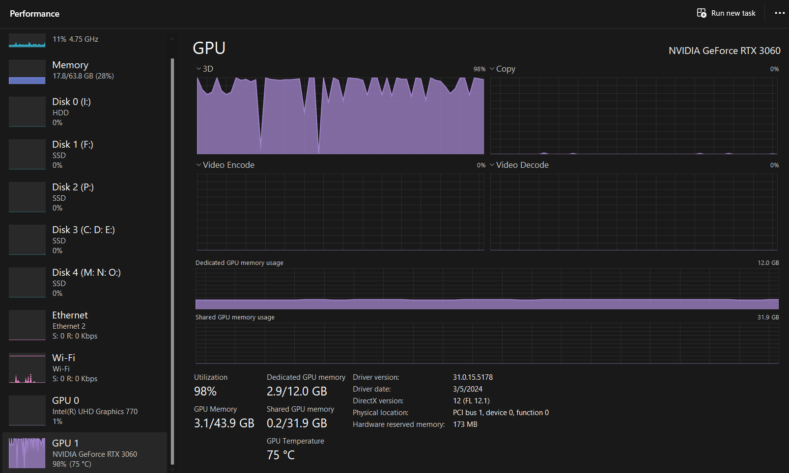

Epoch 1: 100%|██████████████████████████████████████████████████████████████████████████████████████████████████████████████████████████████████| 450/450 [06:05<00:00,  1.23it/s]Epoch 1 Average Loss: 0.3927
Epoch 2:  70%|███████████████████████████████████████████████████████████████████████████████████████████▌                                      | 317/450 [04:20<01:47,  1.24it/s]Epoch 2: 100%|██████████████████████████████████████████████████████████████████████████████████████████████████████████████████████████████████| 450/450 [06:09<00:00,  1.22it/s]Epoch 2 Average Loss: 0.2181
Epoch 3: 100%|██████████████████████████████████████████████████████████████████████████████████████████████████████████████████████████████████| 450/450 [06:08<00:00,  1.22it/s]Epoch 3 Average Loss: 0.2002
Epoch 4: 100%|██████████████████████████████████████████████████████████████████████████████████████████████████████████████████████████████████| 450/450 [06:08<00:00,  1.22it/s]Epoch 4 Average Loss: 0.1916
Epoch 5: 100%|██████████████████████████████████████████████████████████████████████████████████████████████████████████████████████████████████| 450/450 [06:07<00:00,  1.22it/s]
Epoch 5 Average Loss: 0.1863
Epoch 6: 100%|██████████████████████████████████████████████████████████████████████████████████████████████████████████████████████████████████| 450/450 [06:08<00:00,  1.22it/s]
Epoch 6 Average Loss: 0.1830
Epoch 7: 100%|██████████████████████████████████████████████████████████████████████████████████████████████████████████████████████████████████| 450/450 [06:07<00:00,  1.22it/s]
Epoch 7 Average Loss: 0.1803
Epoch 8: 100%|██████████████████████████████████████████████████████████████████████████████████████████████████████████████████████████████████| 450/450 [06:08<00:00,  1.22it/s]Epoch 8 Average Loss: 0.1788
Epoch 9: 100%|██████████████████████████████████████████████████████████████████████████████████████████████████████████████████████████████████| 450/450 [06:07<00:00,  1.22it/s]Epoch 9 Average Loss: 0.1767
Epoch 10: 100%|█████████████████████████████████████████████████████████████████████████████████████████████████████████████████████████████████| 450/450 [06:05<00:00,  1.23it/s]Epoch 10 Average Loss: 0.1754
Epoch 11: 100%|█████████████████████████████████████████████████████████████████████████████████████████████████████████████████████████████████| 450/450 [06:04<00:00,  1.23it/s]Epoch 11 Average Loss: 0.1743
Epoch 12: 100%|█████████████████████████████████████████████████████████████████████████████████████████████████████████████████████████████████| 450/450 [06:02<00:00,  1.24it/s]Epoch 12 Average Loss: 0.1731
Epoch 13: 100%|█████████████████████████████████████████████████████████████████████████████████████████████████████████████████████████████████| 450/450 [06:01<00:00,  1.24it/s]Epoch 13 Average Loss: 0.1730
Epoch 14: 100%|█████████████████████████████████████████████████████████████████████████████████████████████████████████████████████████████████| 450/450 [06:01<00:00,  1.24it/s]Epoch 14 Average Loss: 0.1726
Epoch 15:  48%|█████████████████████████████████████████████████████████████▉                                                                   | 216/450 [02:55<03:07,  1.25it/s]

